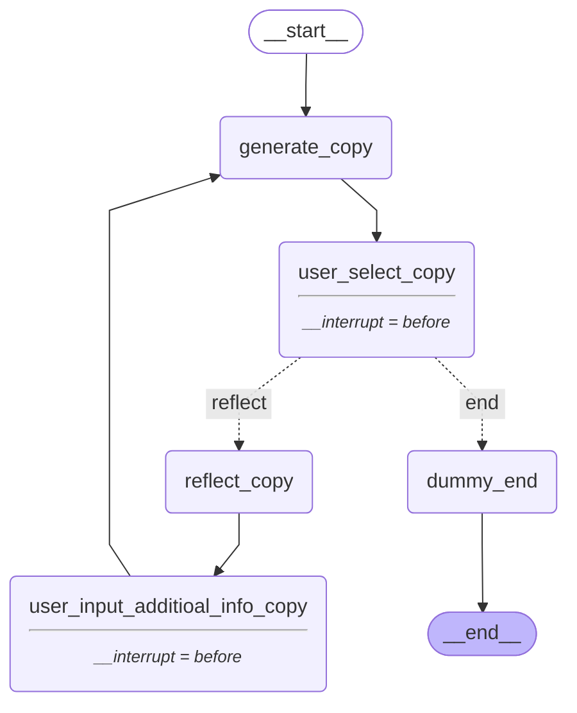

# Streamlit × LangGraph（Human-in-the-loop）キャッチコピー生成アプリ

本リポジトリは、StreamlitとLangGraphを用いたキャッチコピー生成アプリのサンプルコードである。  
LangGraphによるHuman-in-the-loopも実現している。

[](./images/demo.gif)

## 特徴
- **LangGraphによる柔軟なワークフロー定義:**  LangGraphによって処理フローをグラフ構造で定義し、柔軟なワークフローを実現している。
- **Human-in-the-loopによる品質向上:**  AIによる生成結果に人間の意見を反映することで、より高品質なキャッチコピーを生成できる。
- **Streamlitよる簡単なWebアプリ化:**  Streamlitを利用して、簡単にWebアプリ化している。LangGraph Human-in-the-loopをStreamlit上で実装した例は、執筆時点（2024/12/1）でほとんど存在しない。

## 使い方

1. **リポジトリのクローン**

    ```bash
    git clone https://github.com/yamato0811/langgraph-streamlit-human-in-the-loop.git
    cd langgraph-streamlit-human-in-the-loop
    ```

2. **仮想環境の作成（推奨）**

    ```bash
    python -m venv .venv
    source .venv/bin/activate
    ```

3. **ライブラリのインストール**

    ```bash
    pip install -r requirements.txt
    ```

4. **環境変数の設定**

    `.env.example` をコピーして `.env` を作成し、`.env` ファイル内の `OPENAI_API_KEY` にOpenAIのAPIキーを設定する。  
    OpenAIのAPIキーは、[OpenAIのダッシュボード](https://platform.openai.com/account/api-keys)から作成・取得できる。

    ```bash
    cp .env.example .env
    ```

5. **Streamlitアプリの起動**

    ```bash
    streamlit run app.py
    ```

    ブラウザでアプリが起動し、アプリを利用できる。

## アプリの概要
アプリは以下の手順でキャッチコピーを生成する。

### アプリ実行の流れ
1. **キャッチコピー生成の開始**:  
    アプリを開始すると、最初のノード（`__start__`）に到達する。このノードは、アプリの開始を表す。
2. **キャッチコピー生成**:  
    `generate_copy`ノードに到達すると、AgentはLLM（今回はOpenAI GPT-4o）を用いてキャッチコピーを生成する。
3. **ユーザーの選択**:  
    `user_select_copy`ノードに到達すると、ユーザーに生成されたキャッチコピーを表示し、ユーザーに選択を促す。
    もし、ユーザーが「再検討」を選択した場合は、`reflect_copy`ノードに遷移する。
4. **キャッチコピーの改善**:  
    `reflect_copy`ノードに到達すると、Agentは生成したキャッチコピーの改善点と改善に必要な追加情報を思考する。
5. **ユーザーの追加情報の入力**:  
    `user_input_additioal_info_copy`ノードに到達すると、ユーザーに追加情報の入力を促す。
6. **キャッチコピーの再生成**:  
    ユーザーが追加情報を入力すると、`generate_copy`ノードに戻り、Agentはキャッチコピーの再生成を行う。
7. **キャッチコピー生成の終了**:  
    ユーザーが生成されたキャッチコピーを承認すると、`dummy_end`ノードに到達し、キャッチコピー生成が終了する。

※ 2~6の手順は、ユーザーが生成されたキャッチコピーを承認するまで繰り返される（いわゆるAgent Loop）。

### LangGraphのグラフ構造
以下は、本アプリのグラフ構造である。


## ディレクトリ構成
`src`ディレクトリ配下の主要なファイル・ディレクトリは以下の通り。

```
.
├── agent                       
│   ├── agent.py                # エージェントのメインロジック
│   ├── graph.py                # LangGraphのグラフ定義
│   ├── node.py                 # LangGraphのノード定義
│   ├── output_structure.py     # LLM出力構造定義
│   ├── prompt                  
│   │   └── prompt_templates.yaml   # プロンプトテンプレート
│   └── state.py                # LangGraphの状態定義
├── app.py                      # Streamlitアプリのメインロジック
├── components                  
│   └── input_form.py           # 入力フォーム
├── graph.md                    # LangGraphのグラフ構造（Mermaid形式）
├── models                      
│   └── llm.py                  # LLMモデル定義
└── utils                       
    ├── app_session_manager.py  # Streamlitセッション管理
    ├── app_user_input_logic.py # Streamlitユーザー入力ロジック
    ├── app_util.py             # Streamlitユーティリティ関数
    └── node_util.py            # LangGraphノードユーティリティ関数
```

## その他
- `graph.md` は、LangGraphのグラフ構造をMermaid形式で記述したもの。Mermaid対応のエディタやツールで開くことで、グラフを視覚的に確認できる。
- 本アプリは、OpenAI APIを利用している。API利用料金には注意が必要である。
