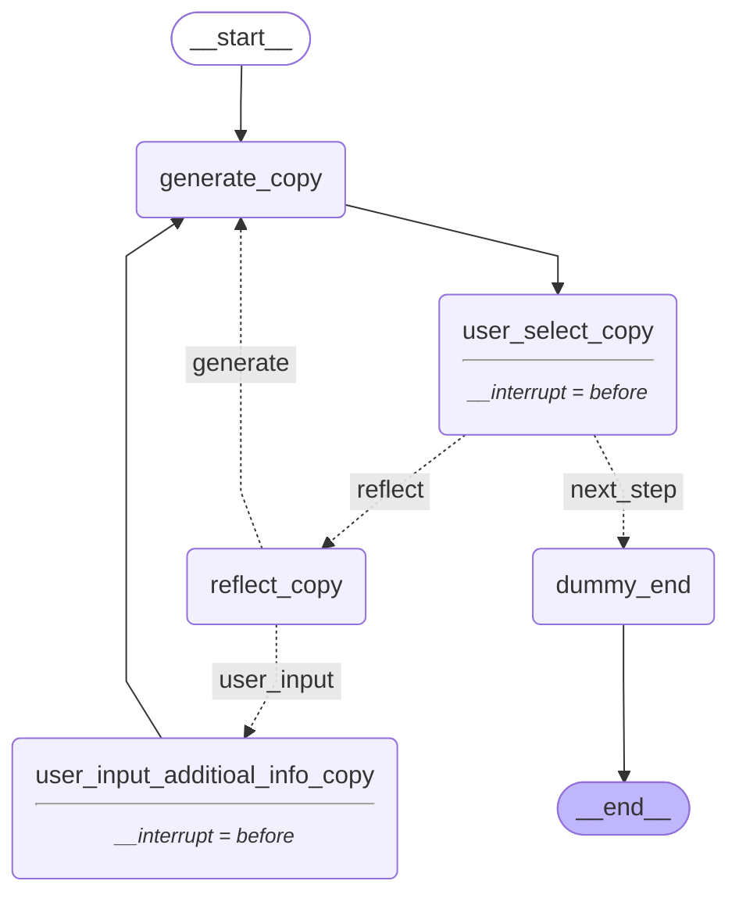

```mermaid
%%{init: {'flowchart': {'curve': 'linear'}}}%%
graph TD;
	__start__([<p>__start__</p>]):::first
	generate_copy(generate_copy)
	user_select_copy(user_select_copy<hr/><small><em>__interrupt = before</em></small>)
	reflect_copy(reflect_copy)
	user_input_additioal_info_copy(user_input_additioal_info_copy<hr/><small><em>__interrupt = before</em></small>)
	dummy_end(dummy_end)
	__end__([<p>__end__</p>]):::last
	__start__ --> generate_copy;
	dummy_end --> __end__;
	generate_copy --> user_select_copy;
	user_input_additioal_info_copy --> generate_copy;
	user_select_copy -. &nbsp;reflect&nbsp; .-> reflect_copy;
	user_select_copy -. &nbsp;next_step&nbsp; .-> dummy_end;
	reflect_copy -. &nbsp;generate&nbsp; .-> generate_copy;
	reflect_copy -. &nbsp;user_input&nbsp; .-> user_input_additioal_info_copy;
	classDef default fill:#f2f0ff,line-height:1.2
	classDef first fill-opacity:0
	classDef last fill:#bfb6fc
```